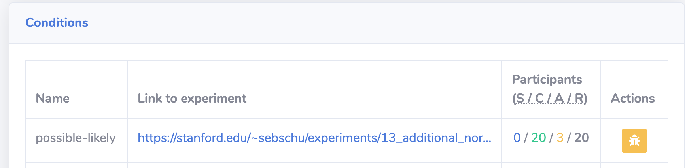
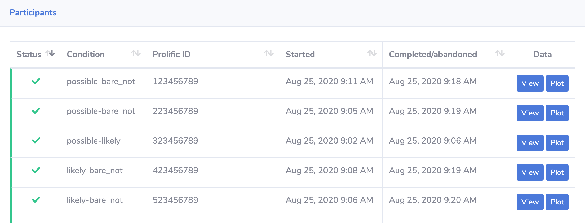
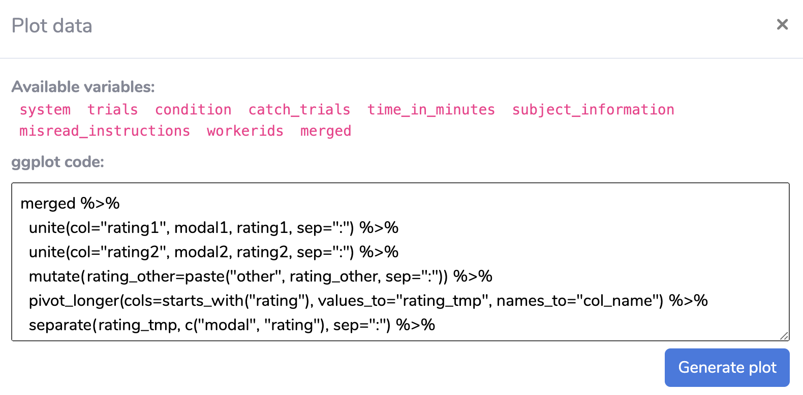

Web interface
=======================================

Instead of using the :doc:`command line interface </cli/index>`, you can also
manage experiments from the web interface at https://proliferate.alps.science/admin/.

Creating an experiment
^^^^^^^^^^^^^^^^^^^^^^^^^

Before you can publish a study on Prolific, you'll have to create
an experiment on proliferate. This will not actually post your experiment (you
currently have to do that on Prolific) but this step is necessary to set up
the proliferate server for storing your data and for redirecting users to the
correct Prolific completion URL.

.. note:: 
   
   Before you can create an experiment, you will have to make sure that your JavaScript experiment
   is hosted somewhere publicly available under a ``https://`` URL. See the 
   :doc:`documentation of the JavaScript library </javascript-library>` for how 
   to set up a JavaScipt experiment. If you want to try out proliferate with
   an example experiment, you can use the following URL:
   ``https://stanford.edu/~sebschu/experiments/prolific-tutorial/experiment-cond-regular.html``

1. Create an study on `Prolific <https://app.prolific.co/studies/new>`_.

   Fill in the title and the description of the study in the "Study Details" section,
   select "I'll redirect them using a URL" in the "Study Completion" section,
   and then copy the completion URL that appears.
   
   Keep this window open since you'll need to go back to it later.
   
2. Go to https://proliferate.alps.science/admin/ and create a new experiment by clicking "Add experiment".
       
3. Fill in the form with the following values:

      :Name: Name of your experiment
      :Prolific completion URL: The completion URL that you copied from Prolific
      :Notes: Optional notes

   Under "Conditions" add the details of your experiment:
   
      :Name: Name of the condition (Can just be something like default if you are only adding one condition.)
      :Experiment URL: The https:// URL to your experiment
      :Participants: Number of participants you want to run, set to 0 if you want to decide later
      
   .. note:: 
   
       Both the ``Name`` and ``Participants`` options are only really relevant if you use proliferate
       to assign participants to different conditions (See instructions :doc:`here </other-features>`). 
       In most cases, you can set these two fields to default values such as "default" and 0.

4. Click "Create experiment". This should redirect you to the experiment detail page.

4. Test your setup using the Sandbox URL and the Prolific "Preview" function. 
   (Optional but recommended.) 

   a. Click "Sandbox mode" in the upper right corner and copy the Sandbox URL.
   
   b. Go back to the Prolific create form from step 1 and paste the Sandbox URL
      into the "Study Link" section on Prolific.
   
   c. Click "Preview" at the bottom of the create form, and in the popup window, 
      click "Open study link in a new window". This should load your experiment in a new window.
   
   d. Go through the entire experiment. At the end of it you should be redirected 
      back to Prolific and it should say "Submission received".
   
   e. Go back to the proliferate web interface and reload the page.
   
   f. Make sure that your data was recorded by clicking on "Download data" to download the sandbox data.
   
     If your data was properly recorded, the Download data button should show several CSV files for download. 
     Make sure that all the data you need is present in the CSV files.
     If no data was recorded or some data is missing, check your experiment code and make sure
     that all data is recorded during the experiment and that all data is sent back to proliferate
     at the end of the experiment. See the :doc:`documentation of the JavaScript library  </javascript-library>` 
     for more information on how to implement an experiment with proliferate.
   
   g. Click on "Exit sandbox mode".
      
5. Publish your experiment.
  
  a. Copy the Study URL.
  
  b. Go back to the Prolific create form from step 1 and copy the Study URL
     into the "Study Link" section on Prolific.
  
  c. Make sure that you select "I'll use URL parameters" below the Study URL after you pasted the URL. 
     This should append several parameters of the form ``?PROLIFIC_PID=...`` to your study URL. If these paremeters are missing,
     select another option (e.g., "I'll add a question in my study") and then click again on "I'll use URL parameters".
     
  d. In the "Audience" section, select the pre-screening criteria that you want to use.
  
  e. In the "Study cost" section, choose the number of participants you would like to run, enter your estimate of how long the experiment will take, 
     and how much participants get paid for participating in your experiment. In the US, you should pay participants at least $15/hour.
     
  f. Click "Publish" to publish your experiment.
  
     At this point, participants will be able to access your experiment. You can then monitor how many participants have completed 
     or at least started your experiment, as described in the next section.

Monitoring an experiment
^^^^^^^^^^^^^^^^^^^^^^^^^

As participants take and complete your experiment, the detail page will show the
progress of your experiment.

Under "Conditions" you will see how many participants have started (S), completed (C) or
abandoned (A) your experiment. The last number is the number of participants you set 
when creating the experiment.

.. note:: 
  
  proliferate does not have access to the participant data from Prolific and therefore the number of started/completed/abandoned participants may be slightly different from what you see on Prolific. Here is what these values mean on proliferate.
  
    :started: The number of participants who have started the study on Prolific and accessed your experiment.
    :completed: The number of participants who have succesfully completed the experiment and submitted their data. If something goes wrong while submitting the data, a participant won't show up as completed.
    :abandoned: The number of participants who have accessed your experiment but then closed it before submitting the data. This is most likely because they either returned the experiment on Prolific or did not complete it before the timeout set by Prolific.
    :requested: If you set the number of participants when creating the experiment, this number will show up as "requested".

Under "Participants" you will see the individual participants and their status. Once a
participant has completed the experiment, you can also view their data by clicking on "Data" and
:ref:`plot <web-plot>` their data.

Downloading results
^^^^^^^^^^^^^^^^^^^^^^^^^

Click on "Download data" and select a CSV file to download. See also :doc:`/data` for
information on the format of these CSV files and how they are generated from the
experimental data.

.. _web-plot:

Plotting data from an experiment
^^^^^^^^^^^^^^^^^^^^^^^^^^^^^^^^^^^

The web interface also allows one to plot the results using `ggplot2 <https://ggplot2.tidyverse.org/>`_.
To plot the entire data or individual participant results, click on Plot to open the following window.

This window shows a list of variables that are available for plotting. These correspond to the CSV files
that are generated from the experimental data and are loaded as R dataframes. You can then use these variables
to write a ggplot2 command for plotting. You can only use one command but you can use `magrittr <https://magrittr.tidyverse.org/>`_ piping
and other tidyverse functionalities to preprocess your data before piping it into ggplot2.

Click "Generate plot" to render the plot.

If you click "Plot" next to an individual participant, all variables will only contain the data from this one participant. 
If you click "Plot" at the top of the page, the variables contain all data from the experiment.

Other functionalities
^^^^^^^^^^^^^^^^^^^^^^^^^^^^^^^^^^^

Deleting sandbox data 
------------------------

When you are in Sandbox mode, you can also delete the sandbox data. This may be useful when you are debugging an experiment
and changing the format of the stored data across runs.

Data from actual participant cannot be deleted.

